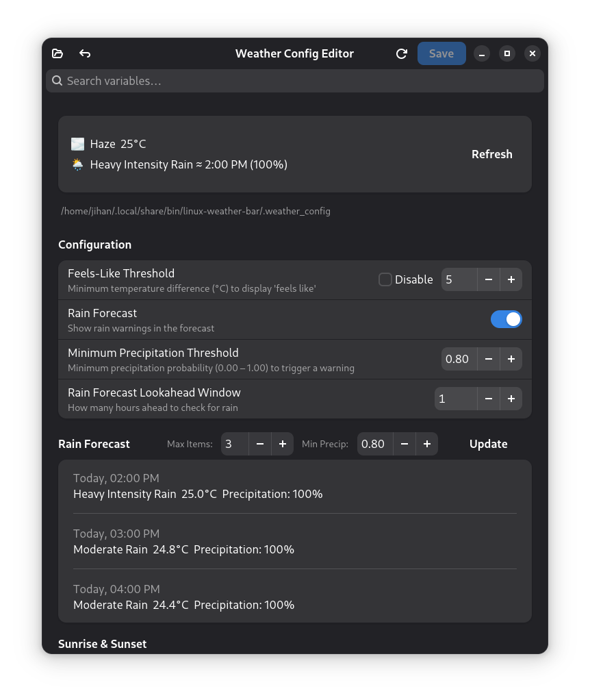
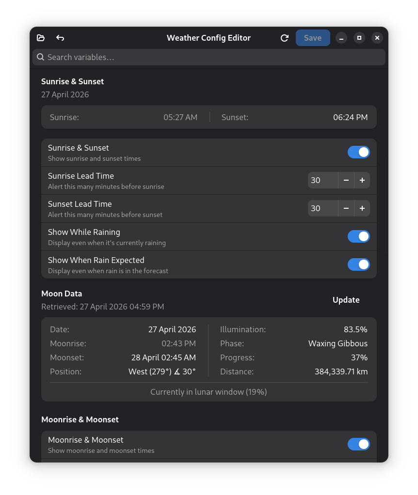
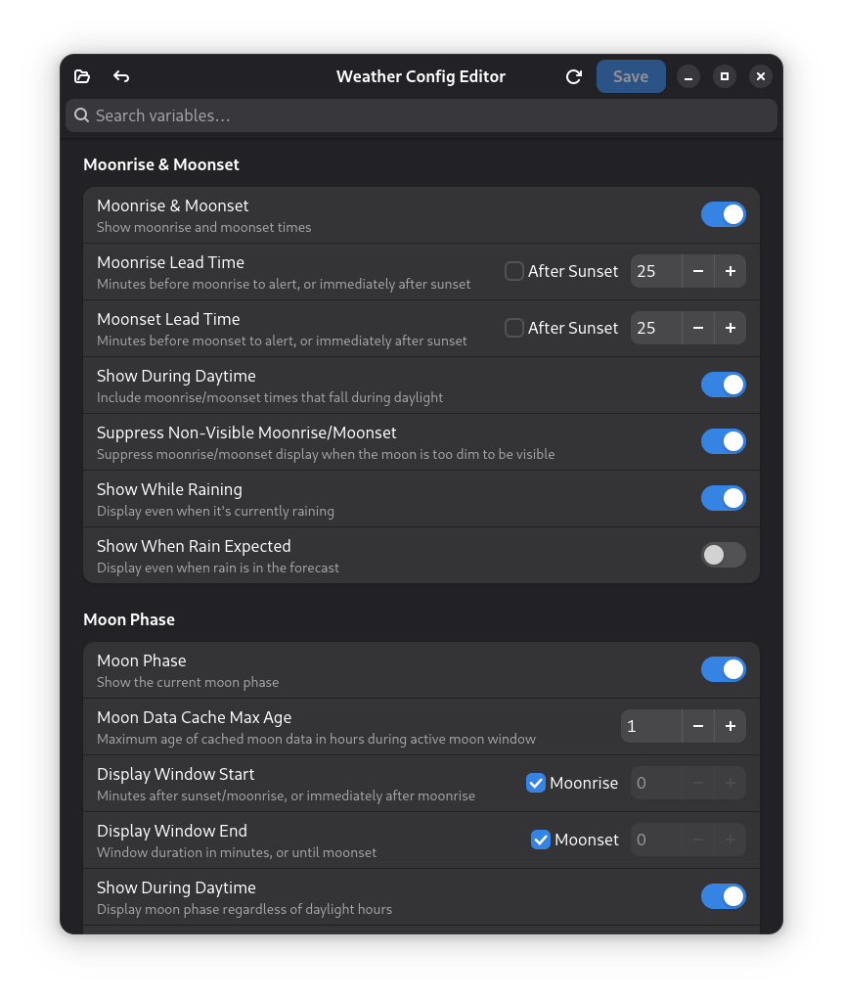
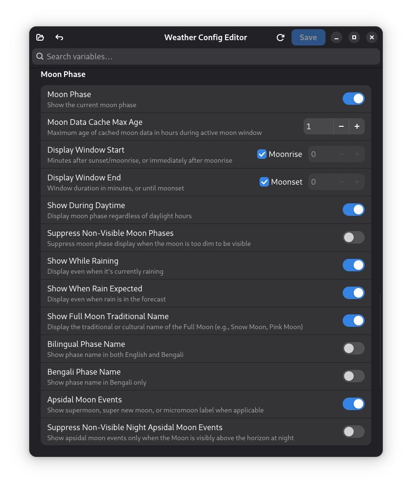
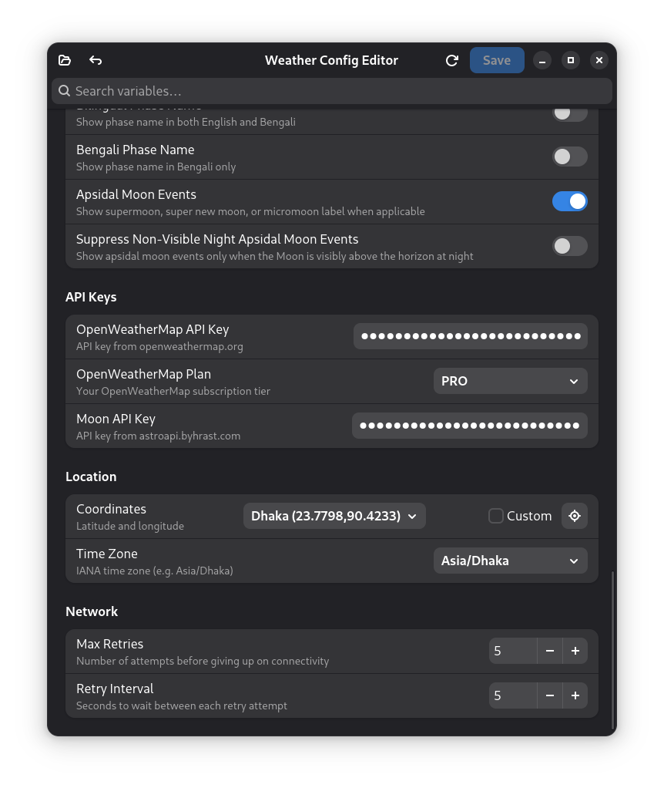

# 🌤️ Linux Weather Bar

A lightweight Bash script that displays live weather, rain forecasts, and advanced lunar data in a Linux status bar — powered by OpenWeatherMap and an astronomical API.

Works with **GNOME (Executor)**, **Waybar**, **Polybar**, **i3blocks**, and any bar that runs a shell command on an interval.

---

## Table of Contents

- [Features](#features)
- [Installation](#installation)
- [Configuration](#configuration)
  - [Required Variables](#required-variables)
  - [API Plan](#api-plan)
  - [Weather Display](#weather-display)
  - [Rain Forecast](#rain-forecast)
  - [Sunrise & Sunset](#sunrise--sunset)
  - [Moon Phase](#moon-phase)
  - [Moonrise & Moonset](#moonrise--moonset)
  - [Apsidal Moon Events](#apsidal-moon-events)
  - [Folk / Traditional Full Moon Names](#folk--traditional-full-moon-names)
  - [Localization](#localization)
  - [Caching](#caching)
  - [Network](#network)
- [Script Flags](#script-flags)
- [Output Modes](#output-modes)
- [Data Sources & APIs](#data-sources--apis)
- [Caching Architecture](#caching-architecture)
- [Display Logic & Smart Behaviors](#display-logic--smart-behaviors)
- [Error Handling & Graceful Degradation](#error-handling--graceful-degradation)
- [Bar Integration](#bar-integration)
- [Python Config Manager (GUI)](#python-config-manager-gui)
- [Project Structure](#project-structure)
- [Example Output](#example-output)
- [License](#license)
- [Contributing](#contributing)

---

## Features

**Weather Engine**
- Live temperature, feels-like, weather condition, and icon from OpenWeatherMap
- Feels-like display is conditional: only shown when the difference from actual temperature exceeds a configurable threshold
- Supports both FREE (3-hourly) and PRO (hourly) OpenWeatherMap API plans

**Rain Forecast Engine**
- Predicts rain within a configurable time window and probability threshold
- Displays time, probability percentage, weather description, and matching icon
- Shows date prefix when the forecast is more than 24 hours away
- Falls back gracefully if forecast data is unavailable

**Sunrise & Sunset System**
- Proximity warnings shown within a configurable lead-time threshold (minutes)
- Effective sunset resolution: uses yesterday's cached sunset during overnight hours to avoid showing tomorrow's sunset prematurely
- Effective sunrise resolution: advances to tomorrow's sunrise once today's has passed
- Rain-aware suppression: sunrise/sunset can be hidden during rain or when rain is forecast

**Advanced Lunar Engine**
- Moon phase display with full astronomical correctness
- Visibility gating using the intersection of the solar window and the lunar window
- Inferred lunar window (12h 25m fallback) when only one of moonrise/moonset is available from the API
- Moonrise and moonset proximity alerts with configurable lead-time or "after sunset" mode
- Apsidal syzygy detection: Supermoon, Micromoon, Super New Moon
- Traditional folk / Farmer's Almanac full moon names by month
- Bengali and bilingual (English + Bengali) phase name display
- Per-feature rain suppression controls for phase, moonrise, and moonset independently
- Illumination-based visibility filtering (below 5% illumination = not visible)
- Night-visibility gate for apsidal events

**Reliability & Performance**
- All lunar and solar calculations use Unix epoch arithmetic, eliminating midnight-crossing bugs
- Intelligent multi-layer cache for weather, forecast, moon, and sun data
- Smart cache staleness detection based on lunar window activity
- Network connectivity check with retry logic before any API call
- Graceful degradation: falls back to cached data when APIs are unreachable

---

## Installation

```bash
git clone https://github.com/RHJihan/linux-weather-bar.git
cd linux-weather-bar

cp .weather_config.template .weather_config
nano .weather_config   # add your API keys and location

chmod +x linux-weather-bar.sh
./linux-weather-bar.sh
```

**Dependencies:** `bash`, `curl`, `jq`, `date` (GNU or BSD), `awk`, `nmcli` (optional — used for connectivity check, falls back to `ping`)

---

## Configuration

All configuration lives in `.weather_config` in the script directory. The file is sourced as a Bash script. On first run, if `.weather_config` does not exist but `.weather_config.template` does, the template is copied automatically.

The file is git-ignored by default to prevent accidental credential commits.

### Required Variables

| Variable   | Example                        | Description                          |
|------------|--------------------------------|--------------------------------------|
| `API_KEY`  | `abc123`                       | OpenWeatherMap API key               |
| `LOCATION` | `lat=23.7626&lon=90.3786`      | URL-encoded lat/lon query string     |

### API Plan

| Variable       | Default | Values          | Description                                              |
|----------------|---------|-----------------|----------------------------------------------------------|
| `API_KEY_TYPE` | `FREE`  | `FREE`, `PRO`   | `FREE` uses `/forecast` (3-hourly); anything else uses `/forecast/hourly` |

### Weather Display

| Variable                | Default   | Description                                                                                     |
|-------------------------|-----------|-------------------------------------------------------------------------------------------------|
| `FEELS_LIKE_THRESHOLD`  | `5`       | Minimum °C difference between temperature and feels-like before feels-like is shown. Set to `disable` to never show feels-like. |

### Rain Forecast

| Variable                   | Default | Description                                                                 |
|----------------------------|---------|-----------------------------------------------------------------------------|
| `SHOW_RAIN_FORECAST`       | `true`  | Master toggle for rain forecast display                                     |
| `RAIN_FORECAST_THRESHOLD`  | `0.80`  | Minimum precipitation probability (0.0 – 1.0) to trigger a rain warning      |
| `RAIN_FORECAST_WINDOW`     | `3`     | Look-ahead window in hours for rain forecast                                |

### Sunrise & Sunset

| Variable                              | Default | Description                                                                    |
|---------------------------------------|---------|--------------------------------------------------------------------------------|
| `SHOW_SUNRISE_SUNSET`                 | `true`  | Master toggle for sunrise/sunset warnings                                      |
| `SUNRISE_WARNING_THRESHOLD`           | `45`    | Minutes before sunrise to start showing the warning                            |
| `SUNSET_WARNING_THRESHOLD`            | `45`    | Minutes before sunset to start showing the warning                             |
| `SHOW_SUNRISE_SUNSET_DURING_RAIN`     | `true`  | Show sunrise/sunset warnings when it is currently raining                      |
| `SHOW_SUNRISE_SUNSET_WITH_RAIN_FORECAST` | `true` | Show sunrise/sunset warnings when rain is forecast                           |

### Moon Phase

Moon phase requires `MOON_API_KEY` and `TIMEZONE` to be set. If `MOON_API_KEY` is absent, `MOON_PHASE_ENABLED` is automatically set to `false` with a warning to stderr.

| Variable                          | Default     | Description                                                                                         |
|-----------------------------------|-------------|-----------------------------------------------------------------------------------------------------|
| `MOON_PHASE_ENABLED`              | `true`      | Master toggle for all moon phase display. Automatically disabled if `MOON_API_KEY` is unset.        |
| `MOON_API_KEY`                    | _(unset)_   | API key for `astroapi.byhrast.com`                                                                  |
| `TIMEZONE`                        | _(unset)_   | IANA timezone string (e.g. `Asia/Dhaka`), passed to the Moon API                                   |
| `MOON_PHASE_WINDOW_START`         | `moonrise`  | When to start showing moon phase. `"moonrise"` = at moonrise; an integer = minutes after sunset (or moonrise when `SHOW_MOONPHASE_DURING_DAYTIME=true`) |
| `MOON_PHASE_WINDOW_DURATION`      | `moonset`   | When to stop showing moon phase. `"moonset"` = at moonset; an integer = minutes after window start. The window is clamped to sunrise so it never extends into daytime. |
| `SHOW_MOONPHASE_DURING_DAYTIME`   | `false`     | If `true`, moon phase can be shown outside the solar window (between sunset and sunrise)            |
| `SUPPRESS_NOT_VISIBLE_MOONPHASE`  | `false`     | If `true`, suppress moon phase display when lunar illumination is below 5%                          |
| `SHOW_MOON_PHASE_DURING_RAIN`     | `true`      | Show moon phase when it is currently raining                                                        |
| `SHOW_MOON_PHASE_WITH_RAIN_FORECAST` | `false`  | Show moon phase when rain is forecast (only evaluated when `SHOW_RAIN_FORECAST=true`)               |
| `MOON_DATA_CACHE_MAX_AGE`         | `2`         | Maximum age in hours of the moon data cache before a refresh is triggered (during the active lunar window) |

### Moonrise & Moonset

| Variable                                  | Default   | Description                                                                                                |
|-------------------------------------------|-----------|------------------------------------------------------------------------------------------------------------|
| `SHOW_MOONRISE_MOONSET`                   | `true`    | Master toggle for moonrise and moonset proximity alerts                                                    |
| `MOONRISE_WARNING_THRESHOLD`              | `45`      | Minutes before moonrise to show alert. Set to `"sunset"` to show the alert only after sunset and only if moonrise is also after sunset. |
| `MOONSET_WARNING_THRESHOLD`               | `45`      | Minutes before moonset to show alert. Set to `"sunset"` to show the alert only after sunset.              |
| `SHOW_MOONRISE_MOONSET_DURING_DAYTIME`    | `false`   | If `false`, moonrise/moonset alerts are suppressed while the sun is up                                     |
| `SUPPRESS_NOT_VISIBLE_MOONRISE_MOONSET`   | `false`   | If `true`, suppress moonrise/moonset alerts when illumination is below 5%                                  |
| `SHOW_MOONRISE_MOONSET_DURING_RAIN`       | `true`    | Show moonrise/moonset alerts when it is currently raining                                                  |
| `SHOW_MOONRISE_MOONSET_WITH_RAIN_FORECAST`| `false`   | Show moonrise/moonset alerts when rain is forecast                                                         |

### Apsidal Moon Events

Apsidal events are detected at New Moon and Full Moon phases only. Thresholds:
- **Supermoon / Super New Moon**: distance ≤ 367,600 km
- **Micromoon**: distance ≥ 401,000 km

The apsidal label is appended to the phase name in parentheses, e.g. `Full Moon (Supermoon)` or `Flower Moon (Supermoon)`.

| Variable                                      | Default | Description                                                                                                              |
|-----------------------------------------------|---------|--------------------------------------------------------------------------------------------------------------------------|
| `SHOW_APSIDAL_MOON_EVENTS`                    | `true`  | Enable detection and display of Supermoon, Micromoon, and Super New Moon labels                                          |
| `SUPPRESS_NOT_VISIBLE_NIGHT_APSIDAL_MOON_EVENTS` | `false` | If `true`, suppress apsidal labels when the moon is not visible at night. Applies the same illumination (<5%) and arc-overlap check used by the general visibility gate. This typically hides Super New Moon labels since New Moons have near-zero illumination. |

### Folk / Traditional Full Moon Names

When enabled, the generic "Full Moon" label is replaced with the traditional Algonquin / Farmer's Almanac name for that calendar month. The folk name is also used as the base in bilingual mode.

| Month     | Folk Name      |
|-----------|----------------|
| January   | Wolf Moon      |
| February  | Snow Moon      |
| March     | Worm Moon      |
| April     | Pink Moon      |
| May       | Flower Moon    |
| June      | Strawberry Moon|
| July      | Buck Moon      |
| August    | Sturgeon Moon  |
| September | Harvest Moon ¹ |
| October   | Hunter's Moon  |
| November  | Beaver Moon    |
| December  | Cold Moon      |

¹ The Harvest Moon is technically the full moon nearest the autumn equinox and may fall in September or October. The script uses a month-based approximation (always September).

| Variable                  | Default | Description                                                              |
|---------------------------|---------|--------------------------------------------------------------------------|
| `SHOW_FULL_MOON_FOLK_NAME`| `true`  | Replace "Full Moon" with the traditional folk name for the current month |

Folk names are independent of apsidal events. A full moon can display as `Flower Moon (Supermoon)` when both features are active.

### Localization

| Variable                  | Default | Description                                                                       |
|---------------------------|---------|-----------------------------------------------------------------------------------|
| `SHOW_MOONPHASE_BENGALI`  | `false` | Display moon phase name in Bengali only (e.g. `পূর্ণিমা`)                       |
| `SHOW_MOONPHASE_BILINGUAL`| `false` | Display moon phase in English with Bengali in parentheses. Overrides `SHOW_MOONPHASE_BENGALI`. Apsidal labels are always appended in English when bilingual mode is active. |

Example bilingual output: `🌕  Flower Moon (পূর্ণিমা) (Supermoon)`

### Caching

| Variable                  | Default | Description                                                              |
|---------------------------|---------|--------------------------------------------------------------------------|
| `MOON_DATA_CACHE_MAX_AGE` | `2`     | Hours before cached moon data is considered stale (inside lunar window)  |

Cache file locations:

| File                                  | Contents                             |
|---------------------------------------|--------------------------------------|
| `~/.cache/weather/weather-data.json`  | Latest current weather API response  |
| `~/.cache/weather/forecast-data.json` | Latest forecast API response         |
| `~/.cache/weather/moon-data.json`     | Latest moon data (phase, times, position) |
| `~/.cache/weather/sun-data.json`      | Today's sunrise/sunset for overnight use |

### Network

| Variable                    | Default | Description                                              |
|-----------------------------|---------|----------------------------------------------------------|
| `MAX_CONNECTIVITY_RETRIES`  | `5`     | Number of connectivity check attempts before giving up   |
| `CONNECTIVITY_RETRY_DELAY`  | `5`     | Seconds to wait between connectivity check retries       |

---

## Script Flags

These are environment variables read at runtime. They are not stored in `.weather_config` and are intended for programmatic or integration use.

| Variable               | Default | Description                                                                                                                           |
|------------------------|---------|---------------------------------------------------------------------------------------------------------------------------------------|
| `EMIT_JSON_OUTPUT`     | `false` | When `true`, the script outputs the weather display line, then the separator `---END-WEATHER-LINE---`, then a JSON object containing the raw weather and forecast API responses. If forecast data is unavailable, the JSON object contains only `{weather: ...}`. |
| `DISABLE_CACHE_WRITE`  | `false` | When `true`, the script skips writing to all cache files (`weather-data.json`, `forecast-data.json`, `moon-data.json`). Useful when the script is invoked from another script that manages its own caching. |

---

## Output Modes

### Default (bar display)

The script outputs a single line of text suitable for a status bar:

```
               ☀️  Clear Sky  32°C  (Feels 36°C)    Sunset: 6:18 PM    🌕  Flower Moon (Supermoon)
```

The line is padded with leading spaces for centering in GNOME Executor.

### JSON output (`EMIT_JSON_OUTPUT=true`)

```
               ☀️  Clear Sky  32°C    Sunset: 6:18 PM
---END-WEATHER-LINE---
{"weather": { ... OWM current weather response ... }, "forecast": { ... OWM forecast response ... }}
```

The separator `---END-WEATHER-LINE---` allows callers to split the text line from the JSON payload using a simple string split. This mode is used by the Python config manager to populate its live data panels without making independent API calls.

---

## Data Sources & APIs

| API                     | Endpoint                              | Purpose                                             |
|-------------------------|---------------------------------------|-----------------------------------------------------|
| OpenWeatherMap current  | `/data/2.5/weather`                   | Temperature, condition, icon, sunrise, sunset       |
| OpenWeatherMap forecast | `/data/2.5/forecast` (FREE)           | 3-hourly precipitation probability and description  |
| OpenWeatherMap forecast | `/data/2.5/forecast/hourly` (PRO)     | Hourly precipitation probability                    |
| AstroAPI                | `astroapi.byhrast.com/moon.php`       | Moon phase, illumination, moonrise, moonset, distance |

All API requests use `curl -sf` (silent, fail on HTTP error). Responses are validated with `jq -e` before use. Invalid JSON causes the request to be treated as a failure.

---

## Caching Architecture

### Weather & Forecast Cache

Weather and forecast responses are written to disk after each successful API call (unless `DISABLE_CACHE_WRITE=true`). The cache files are read by the Python config manager's live panels. The script itself always fetches fresh data on each invocation; it does not read from `weather-data.json` or `forecast-data.json` on startup.

### Sun Data Cache (`sun-data.json`)

Today's sunrise and sunset epochs are saved after a successful weather fetch. This file is used only during overnight hours (after midnight, before today's sunrise), when the OWM API returns tomorrow's sunrise/sunset values. In that window, the script reads yesterday's sunset from the cache to correctly determine whether the solar window is active.

The cache is keyed by date (`DD/MM/YYYY`). It is only written during daytime hours (after today's sunrise) and only if today's date is not already in the file, preventing unnecessary writes.

If the cache is absent during overnight hours, the script estimates yesterday's sunset as `today's sunrise − 12 hours`. This is typically accurate to within a few minutes.

### Moon Data Cache (`moon-data.json`)

The moon cache stores the full API response plus two additional fields injected at fetch time:
- `moonrise` — Unix epoch (integer), converted from the API's `HH:MM` string anchored to the response date
- `moonset` — Unix epoch (integer), resolved to the next calendar day when moonset `HH:MM` is earlier than moonrise `HH:MM` (midnight crossing)
- `retrieved_at` — Unix epoch of the fetch

**Date selection logic:** If the cached moonset epoch is still in the future, the active lunar cycle belongs to the cached date (which may be yesterday for overnight midnight-crossing cycles). Once moonset has passed, today's data is fetched.

**Staleness detection:** A cache entry is considered stale when _all_ of the following are true:
1. The current time is inside the active lunar window
2. Either the cache was fetched before the lunar window started (illumination data stale), or the cache age exceeds `MOON_DATA_CACHE_MAX_AGE` hours

Outside the active lunar window, staleness is not evaluated and the cache is always returned as-is.

**Inferred lunar window:** When only one of moonrise or moonset is available (the API may return `"Not visible"` for either), the script infers a 12-hour 25-minute window from the available value. This value is the standard average duration of lunar visibility. Inferred windows are used for cache staleness decisions and moon phase display gating, but not for moonrise/moonset proximity alerts (those require real API data).

---

## Display Logic & Smart Behaviors

### Effective Sunset & Sunrise

The raw sunrise/sunset values from the OWM API represent today's events. After midnight, the API still reports today's (upcoming) sunrise, but sunset is already yesterday's. The script resolves this with two helper functions:

- `get_effective_sunset`: Before today's sunrise → reads yesterday's sunset from `sun-data.json` (estimates if cache absent). After today's sunrise → uses today's sunset directly.
- `get_effective_sunrise`: If today's sunrise has already passed → adds 86,400 seconds (tomorrow's sunrise). Otherwise → today's sunrise.

All solar window comparisons use these effective values, making overnight behavior correct without special-casing.

### Solar Window

The solar window is defined as `[effective_sunset, effective_sunrise)`. Moon phase and moonrise/moonset features that are daytime-suppressed check whether `now` is inside this window using epoch arithmetic. This naturally handles midnight crossings because `effective_sunset` is always less than `effective_sunrise`, even when they span calendar days.

### Moon Phase Window

The final display window for moon phase is the intersection of:
1. The solar window (unless `SHOW_MOONPHASE_DURING_DAYTIME=true`)
2. The effective lunar window (`[moonrise, moonset]`, or inferred if partial)
3. The user-configured window (`MOON_PHASE_WINDOW_START` / `MOON_PHASE_WINDOW_DURATION`)

`MOON_PHASE_WINDOW_START`:
- `"moonrise"` → window starts at (inferred) moonrise
- Integer `N` → `N` minutes after an anchor determined by the position of moonrise relative to sunset, and by `SHOW_MOONPHASE_DURING_DAYTIME`:

  - `SHOW_MOONPHASE_DURING_DAYTIME=false` (default):
    - Moonrise after sunset → anchor is moonrise
    - Moonrise before sunset → anchor is sunset


  - `SHOW_MOONPHASE_DURING_DAYTIME=true` → anchor is always moonrise, regardless of whether moonrise falls before or after sunset

`MOON_PHASE_WINDOW_DURATION`:
- `"moonset"` → window ends at moonset. If the API does not return a moonset time, the script estimates the end of the lunar window based on whatever rise/set data is available, using a standard 12h 25m lunar visibility duration as a fallback.
- Integer `N` → window ends `N` minutes after the start. When   , the window is clamped to sunrise so it never extends into daytime.

### Night Visibility Gate

The night visibility gate determines whether the moon is physically observable during nighttime hours. A moon is considered not visible at night when:

1. **Illumination < 5%** — the moon is too close to the sun (catches New Moon reliably regardless of rise/set times), or
2. **Arc does not overlap the night window** — moonset ≤ effective sunset (gone before night begins), or moonrise ≥ effective sunrise (rises after dawn)

This gate is used by:
- `SUPPRESS_NOT_VISIBLE_MOONPHASE` — suppresses moon phase display
- `SUPPRESS_NOT_VISIBLE_MOONRISE_MOONSET` — suppresses moonrise/moonset alerts
- `SUPPRESS_NOT_VISIBLE_NIGHT_APSIDAL_MOON_EVENTS` — suppresses Supermoon/Micromoon/Super New Moon labels

### Feels-Like Threshold

The feels-like temperature is only appended to the output line when the absolute difference between temperature and feels-like exceeds `FEELS_LIKE_THRESHOLD` degrees Celsius. Setting `FEELS_LIKE_THRESHOLD=disable` suppresses feels-like display entirely regardless of the difference.

### Rain Description Normalization

When the forecast weather description contains the words "rain", "drizzle", or "thunderstorm" (case-insensitive), it is title-cased and used directly (e.g. `Light Rain`). All other descriptions are replaced with the generic label `Rain likely` with icon `🌧️`.

### Rain Epoch Formatting

If the forecast rain event is more than 24 hours in the future, the display includes a date prefix formatted as `%-d %B` (e.g. `14 May 9:00 PM (82%)`). Events within 24 hours show time only.

---

## Error Handling & Graceful Degradation

| Failure scenario                           | Behavior                                                                     |
|--------------------------------------------|------------------------------------------------------------------------------|
| No network connectivity after all retries  | Script exits with code 1; bar shows nothing or last output                   |
| Weather API call fails or returns bad JSON | Prints `Weather data unavailable` to stderr, exits 1                         |
| Forecast API unavailable                   | Rain forecast is silently skipped; weather line is still displayed           |
| Moon API unavailable                       | Moon phase, moonrise/moonset suppressed; existing cache used if present      |
| Moon cache absent and API unavailable      | All moon features silently suppressed for this run                           |
| `MOON_API_KEY` not set                     | `MOON_PHASE_ENABLED` is forced to `false` with a warning to stderr           |
| Moon API returns invalid/unexpected JSON   | Response is discarded; treated the same as an API failure                    |
| Moonrise or moonset is `"Not visible"`     | Time field stored as epoch `0`; inferred lunar window used where applicable  |
| `format_time` fails                        | Falls back to the string `"soon"` in rain warning context                    |
| `sun-data.json` absent during overnight    | Sunset estimated as `today's sunrise − 12 hours`                             |
| `date` command variant (GNU vs BSD)        | Both are tried with a `\|\|` fallback in `format_time` and `hhmm_to_epoch`     |

The script runs with `set -euo pipefail`. Functions that may fail use `|| true` or `|| return 1` at call sites to prevent unintended exits in non-critical paths.

---

## Bar Integration

### GNOME (Executor)

```bash
/path/to/linux-weather-bar.sh
```

Recommended interval: `600` seconds (10 minutes)

### Waybar

```json
"custom/weather": {
  "exec": "~/.local/share/bin/linux-weather-bar/linux-weather-bar.sh",
  "interval": 600
}
```

### Polybar

```ini
[module/weather]
type = custom/script
exec = ~/.local/share/bin/linux-weather-bar/linux-weather-bar.sh
interval = 600
```

### i3blocks

```ini
[weather]
command=~/.local/share/bin/linux-weather-bar/linux-weather-bar.sh
interval=600
```

---

## Python Config Manager (GUI)

`weather_config_editor.py` is a GTK4 + libadwaita GUI for editing `.weather_config`.

**Requires:** GTK4, libadwaita

```bash
GSETTINGS_SCHEMA_DIR=. python weather_config_editor.py
```

A `.desktop` entry is included for GNOME application launcher integration. Place it in `~/.local/share/applications/`.

### Screenshots

<p align="center">
  
  
  
  
  
</p>

---

### Key Features

- Schema-driven UI: auto-generated from a typed variable registry supporting `string`, `integer`, `float`, `boolean`, `enum`, and `NUMERIC_OR_SENTINEL` types (fields that accept either a number or a symbolic value such as `moonrise`, `moonset`, or `sunset`)
- Dependency-aware field disabling: sub-options are automatically insensitive when their parent toggle is off; inverse dependencies supported (e.g. bilingual mode disables Bengali-only)
- Comment-preserving file writes: inline comments and unrecognized lines are never modified
- Per-field undo stack that survives saves; Undo button disabled when stack is empty
- Live search bar filtering all rows by label, key name, and description
- Secret fields for API keys (password-entry widget, masked when not focused)
- Auto-load from last opened path (GSettings), then script directory, then `~/.weather_config`

### Live Data Panels

| Panel           | Source file               | Contents                                                                                      |
|-----------------|---------------------------|-----------------------------------------------------------------------------------------------|
| Sun Data        | `weather-data.json`       | Sunrise and sunset in local time; past events visually dimmed                                 |
| Rain Forecast   | `forecast-data.json`      | Upcoming entries above threshold; inline Min Precip and Max Items controls; Update button     |
| Moon Data       | `moon-data.json`          | Phase, illumination, progress, moonrise/moonset, position, distance; apsidal and window status alerts; Update button |

All panels have an **Update** button that invokes the script in a background thread (using `EMIT_JSON_OUTPUT=true` and `DISABLE_CACHE_WRITE=false`) and refreshes the display from the new cache file.

### Location Picker

Loads `location_mappings.csv` into a searchable dropdown (deduplicated by name + coordinates, sorted alphabetically). Falls back to manual latitude/longitude entry. A Google Maps button opens the current coordinates in the system browser. When coordinates do not match any preset, Custom mode activates automatically.

### Timezone Picker

Populated from `zone.tab` (IANA timezone database) with substring search filtering. Falls back to a plain text entry when `zone.tab` is absent. Validation is performed on save.

### Auto-restart on Save

After writing `.weather_config`, the editor automatically restarts the GNOME Executor extension so changes take effect immediately without manual intervention.

---

## Project Structure

```
linux-weather-bar/
├── linux-weather-bar.sh            # Main script
├── weather_config_editor.py        # GTK4 config manager
├── .weather_config.template        # Config template (copy to .weather_config)
├── .weather_config                 # Local config (git-ignored)
├── location_mappings.csv           # Optional location presets for GUI picker
├── zone.tab                        # IANA timezone database for GUI picker
└── README.md
```

---

## Example Output

```
☀️   Clear Sky   32°C (Feels 36°C)    Sunset: 6:18 PM
⛅️   Few Clouds   28°C    🌧️ Rain ≈ 9:00 PM (73%)
☁️   Scattered Clouds   31°C    🌗 Last Quarter
🌫️   Haze   28°C    🌕 পূর্ণিমা
☁️   Scattered Clouds   28°C    🌕 Flower Moon (Supermoon)
☁️   Overcast Clouds   29°C    🌕 Flower Moon (পূর্ণিমা) (Supermoon)
🌦️   Light Rain   26°C
☀️   Clear Sky   32°C    Moonset: 8:24 AM
🌫️   Haze   31°C    ☔️   Moderate Rain ≈ 9:00 PM (80%)
⛅️   Few Clouds   27°C    🌧️ Rain ≈ 14 May 6:00 AM (85%)
```

---

## APIs

| API            | Base URL                          | Auth            | Purpose                               |
|----------------|-----------------------------------|-----------------|---------------------------------------|
| OpenWeatherMap | `api.openweathermap.org/data/2.5` | `appid` param   | Current weather and forecast          |
| AstroAPI       | `astroapi.byhrast.com/moon.php`   | `key` param     | Moon phase, rise/set, illumination, distance |

---

## License

GNU Affero General Public License v3.0 — see [LICENSE](LICENSE) for details.

---

## Contributing

Pull requests are welcome. For major changes, please open an issue first to discuss the proposed change.